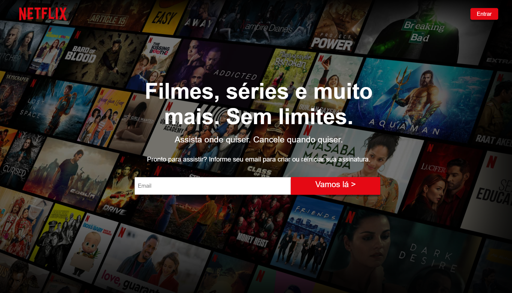

<h1>Clone UI Netflix</h1>

## 📚 About

Clone de interface da tela home e login da **Netflix**, projeto prático afim de estudar um pouco mais sobre posicionamento e CSS. Foi um pequeno projeto que contribuiu para um bom aprendizado na area do Front-end.

## 🛠 Tools

- [HTML](https://developer.mozilla.org/pt-BR/docs/Web/HTML)
- [CSS](https://developer.mozilla.org/pt-BR/docs/Web/CSS)

## 🧾 License

This project is under the MIT license. See the file LISENSE for more details.

<h1 align="center">
<a href="netflix-br.netlify.app"> See the site</a>
</h1>
